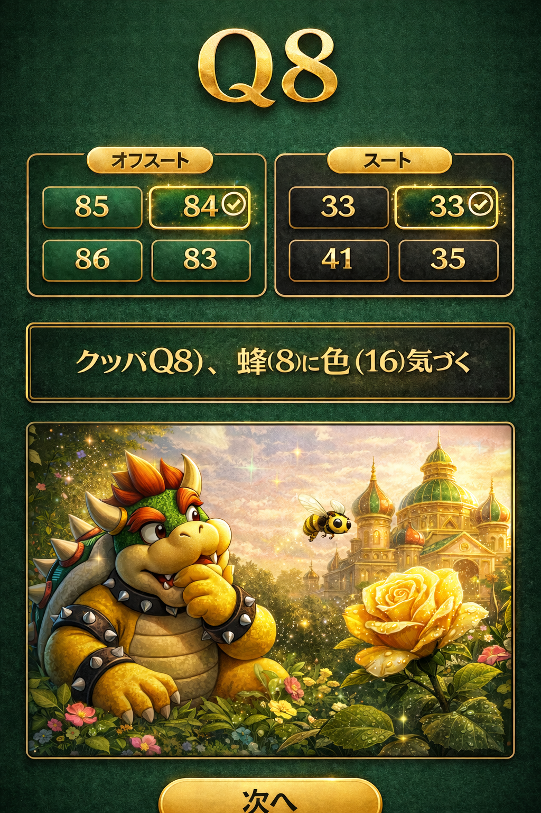

# 画面仕様：回答画面（answer）

## 目的
正解を即座に理解させ、語呂合わせで記憶に定着させる。

## サンプルデザイン

---

## 画面構成

### 1. ハンド表示
- 表示テキスト例：Q8
- 表示位置：画面上部中央
- スタイル：
  - 大きく表示
  - クイズ画面と同じ見た目

---

### 2. 正解表示（選択肢）

#### 左：オフスート
- 正解の選択肢に「◯」を表示
- スタイル：
  - 枠を強調（緑 or ゴールド）
  - 軽い発光 or アニメーション

#### 右：スート
- 正解の選択肢に「◯」を表示
- スタイル：
  - 左と統一

#### ポケットペアの場合
- 選択肢は1つのみ（オフスート・スートの区別なし）
- 正解の選択肢に「◯」を表示
- スタイル：
  - 左右と統一（緑 or ゴールドで強調、軽い発光 or アニメーション）

👉 「どれが正解か」を一瞬で理解させろ

---

### 3. 語呂合わせテキスト

- 表示位置：選択肢の下
- 表示例：
  - クッパ（Q8）、蜂（8）に色（16）気づく
- スタイル：
  - 中央寄せ
  - 少し大きめ
  - 強調（太字 or 色変更）

👉 数字と意味を結びつけるのが目的

---

### 4. イメージ画像

- 表示位置：語呂テキストの下
- 内容：
  - 語呂を連想できるイラスト
  - 例：
    - クッパ風のキャラ
    - 蜂
    - 色づいた花や物体

- スタイル：
  - 横幅いっぱい
  - 角丸
  - カード風

---

## レイアウト

- 上から順に配置：
  1. ハンド（Q8）
  2. 正解表示（左右）
  3. 語呂テキスト
  4. イメージ画像
  5. 「次の問題」ボタン

---

## デザイン指針

- 背景：ダークグリーン
- 正解：
  - 緑 or ゴールドで強調
- 不正解：
  - 目立たせない（暗くする）

---

## インタラクション

### 表示タイミング
- クイズ画面から即遷移

---

### アニメーション
- 正解の選択肢に軽いアニメーション
  - フェードイン
  - スケールアップ

---

## 禁止事項

- 解説を長文で書くな
- UIを複雑にするな
- 情報を増やしすぎるな

👉 「正解」と「記憶」だけに集中させろ

---

## 補足

この画面は「覚えさせる」フェーズ。
視覚（画像）＋言語（語呂）で強制的に記憶に残せ。