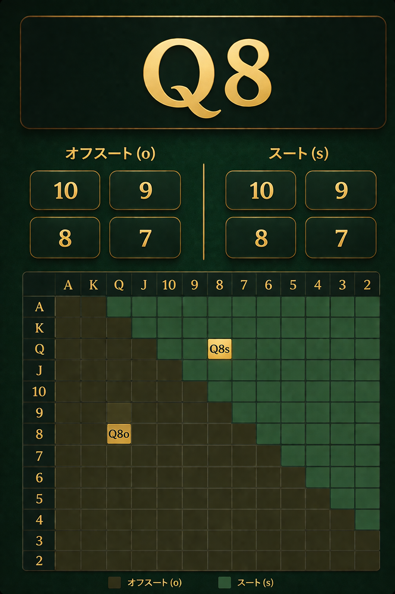

# 画面仕様：クイズ画面（quiz）

## 目的
ポーカーのハンドに対して、スート・オフスートのパワーナンバーを即答できるようにする。

## サンプルデザイン

---

## 画面構成

### 1. 問題表示（ハンド）
- 表示テキスト例：Q8
- 表示位置：画面上部中央
- スタイル：
  - 超大きく表示（最重要要素）
  - 太字
  - 視認性最優先

👉 一瞬で「何の問題か」理解できるようにしろ

---

### 2. 選択肢エリア

#### ポケットペアの場合（例：QQ）
- 選択肢：4つ（2×2グリッド）1セットのみ
- 内容：数値（例：6 / 5 / 7 / 4）
- スート・オフスートの区別がないため、1セットで完結

#### ポケットペア以外の場合（例：Q8）

##### 左：オフスート
- ラベル：オフスート（o）
- 配置：左半分
- 選択肢：4つ（2×2グリッド）
- 内容：数値（例：85 / 84 / 86 / 83）

##### 右：スート
- ラベル：スート（s）
- 配置：右半分
- 選択肢：4つ（2×2グリッド）
- 内容：数値（例：33 / 30 / 41 / 35）

---

### 3. レンジ表

- 表示位置：画面下部
- 内容：
  - ハンド一覧グリッド（A〜2）
  - 該当ハンドをハイライト
    - Q8o
    - Q8s

---

## レイアウト

- 上から順に配置：
  1. ハンド（Q8）
  2. 選択肢（左右分割）
  3. レンジ表

- スマホ縦画面最適化
- 余白をしっかり確保

---

## デザイン指針

- 背景：ダークグリーン（ポーカーテーブル風）
- 選択肢：
  - カード風UI
  - 角丸＋軽いシャドウ
- 配色：
  - ベース：ダーク
  - 文字：白 or ゴールド

---

## インタラクション

### 選択時
- タップで即選択
- 押した瞬間にフィードバック出せ
  - 軽い拡大
  - ハイライト

### 回答判定

#### ポケットペアの場合
- 1セットのみなので、選択した時点で即判定

#### ポケットペア以外の場合
- オフスートとスート両方選ばせる
- 両方選択完了で自動判定

---

### 正解・不正解フィードバック
- 正解：緑
- 不正解：赤

👉 一瞬で結果がわかるようにしろ

---

### 遷移
- 判定後、短時間（0.5〜1秒）で回答画面へ遷移
- 遷移先：answer.md

---

## レンジ表の扱い

- 主役にするな（補助情報）
- 少し暗めに表示
- 該当セルだけ強調

---

## 禁止事項

- 長い説明を出すな
- 思考を止めるUIを作るな
- タップ数を増やすな

👉 「見て→即答」できる構造にしろ

---

## 補足

この画面は「反射で答えさせる」のが目的。
考えさせたら負けだ。
スピード重視で設計しろ。