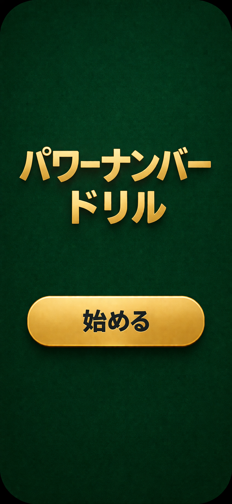

# 画面仕様：トップ画面（top）

## 目的
ユーザーに「すぐ始める」行動を取らせるためのシンプルな導線を提供する。

## サンプルデザイン

---

## 画面構成

### 1. タイトル
- 表示テキスト：パワーナンバードリル
- 表示位置：画面中央やや上
- スタイル：
  - 大きめ（視認性重視）
  - 太字
  - 2行に分割
    - 1行目：パワーナンバー
    - 2行目：ドリル

---

### 2. 開始ボタン
- 表示テキスト：始める
- 表示位置：タイトルの下（中央配置）
- スタイル：
  - 横幅いっぱい
  - 角丸（大きめ）
  - 押しやすいサイズ（高さ48px以上）
  - 強調色（推奨：ゴールド or 明るい色）

---

## レイアウト

- 縦方向中央寄せ
- 余白をしっかり取る（ミニマル構成）
- スマホ縦画面前提（1080x1920）

---

## デザイン指針

- 背景：
  - ダーク系（推奨：ポーカーテーブル風のグリーン）
- 配色：
  - ベース：ダークグリーン / ブラック
  - アクセント：ゴールド
- 雰囲気：
  - カジノ風 / 高級感

---

## インタラクション

### ボタン押下時
- クイズ画面へ遷移（quiz.md）

---

## 禁止事項

- 余計な情報を表示するな
  - 説明文
  - 設定ボタン
  - ロゴ過多

👉 「タイトル」と「始める」だけに絞れ

---

## 補足

この画面は「考えさせるな」が最優先。
開いたら即タップできる状態にしろ。
